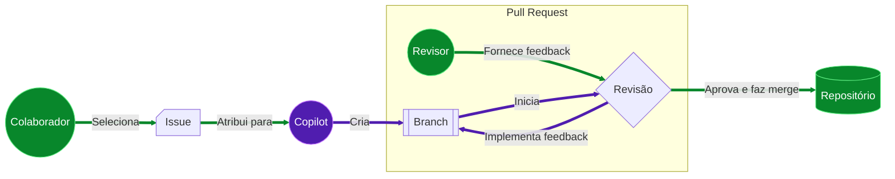

## Etapa 1: Habilite o agente de código Copilot

No exercício [Primeiros Passos com o GitHub Copilot](/skills/getting-started-with-github-copilot), aprendemos como usar o Copilot no editor de código para fazer grandes melhorias no site de Atividades Extracurriculares da Escola Mergington. 🎻 ⚽️ ♟️

Na verdade, o site se tornou uma ferramenta regular da escola. E, embora você goste dessa atenção, percebeu um problema! Você está prestes a sair de licença no próximo semestre!

Após conversar com a direção, eles aceitaram que novas funcionalidades podem esperar, mas... ficaram preocupados. É preciso ter _algo_ para lidar com pequenas mudanças enquanto você estiver ausente.

Vamos preparar os professores para o sucesso, cadastrando o Copilot (na nossa escola) para cuidar das atualizações enquanto estivermos fora.


### O Copilot agora é seu agente de código!

Em exercícios anteriores, usamos o Copilot em **chat**, **edições** e modo **agente**. Embora esses modos sejam úteis, o **agente de código Copilot** leva isso a outro nível, operando totalmente pelo GitHub. Não precisa de editor de código! 😎

| Recurso           | Copilot no editor             | Agente de código Copilot |
| ----------------- | ----------------------------- | ------------------------ |
| **Interface**     | Seu editor de código          | Issues e Pull Requests   |
| **Escopo**        | Arquivos locais               | Repositório              |
| **Ativação**      | Sugestões inline, chat        | Atribuição de issue      |
| **Customização**  | Instruções personalizadas     | Instruções personalizadas|
| **Suporte MCP**   | Sim                          | Sim                      |
| **Vibe Coding**   | 😎                            | 😎                       |

### Como funciona?

Do ponto de vista do colaborador, o fluxo é muito parecido com o de um projeto normal.

1. Um colaborador com **acesso de escrita** seleciona uma issue e a atribui ao Copilot (em vez de si mesmo).
2. O Copilot cria um branch e um pull request.
3. O Copilot trabalha no branch em um workflow do Actions e fornece atualizações na aba de conversas do pull request.
4. Quando o Copilot termina a issue, quem atribuiu é solicitado a revisar.
5. O responsável faz a revisão, adiciona comentários ou aprova.
6. Se houver feedback, o Copilot continua trabalhando para implementar as sugestões.
7. O solicitante repete os passos acima até ficar satisfeito e então faz o merge.



### Isso é seguro?

Várias precauções de segurança foram implementadas para ajudar a reduzir preocupações. Aqui estão algumas limitações que você deve considerar ao pedir para o Copilot trabalhar em uma issue.

- O Copilot só pode fazer alterações no branch que ele criou e nos recursos fornecidos pelo repositório.
- O Copilot possui um [firewall configurável](https://docs.github.com/en/enterprise-cloud@latest/early-access/copilot/coding-agent/customizing-copilot-coding-agents-development-environment#customizing-or-disabling-the-agents-firewall) que restringe o acesso à internet.
- Apenas usuários com acesso de escrita podem atribuir uma issue ao Copilot.
- Conteúdo oculto em issues (como código comentado) é ignorado.

> [!IMPORTANT]
> A lista completa de mitigações e configurações pode ser encontrada na documentação [Riscos e Mitigações](https://docs.github.com/en/enterprise-cloud@latest/early-access/copilot/coding-agent/using-copilot-coding-agent#copilot-coding-agent-risks-and-mitigations).

## ⌨️ Atividade: (opcional) Conheça o site de atividades extracurriculares

> [!NOTE]
> Abrir um ambiente de desenvolvimento e rodar a aplicação não é necessário para completar este exercício. Você pode pular esta atividade se desejar.

<details>
<summary>Mostrar passos</summary>

Em outros exercícios, temos desenvolvido o site de Atividades Extracurriculares. Você pode seguir estes passos para iniciar o ambiente de desenvolvimento e experimentá-lo.

1. Clique com o botão direito do mouse no botão abaixo para abrir a página **Criar Codespace** em uma nova aba. Use a configuração padrão.

   [](https://codespaces.new/{{full_repo_name}}?quickstart=1)

1. Aguarde um tempo para o ambiente ser preparado. Ele instalará automaticamente todos os requisitos e serviços.

1. Valide se as extensões **GitHub Copilot** e **Java** estão instaladas e habilitadas.

   <br/>

1. Tente executar a aplicação. Na barra lateral esquerda, selecione a aba **Run and Debug** e clique no ícone **Iniciar Depuração**.

   <details>
   <summary>📸 Mostrar captura de tela</summary><br/>

   

   </details>

   <details>
   <summary>🤷 Tendo problemas?</summary><br/>

   Se a área **Run and Debug** estiver vazia, tente recarregar o VS Code: Abra a paleta de comandos (`Ctrl`+`Shift`+`P`) e procure por `Developer: Reload Window`.

   

   </details>

1. Use a aba **Ports** para encontrar o endereço da página da web, abri-la e verificar se está em execução.

   <details>
   <summary>📸 Mostrar captura de tela</summary><br/>

   

   </details>

</details>

## ⌨️ Atividade: Habilite o agente de codificação Copilot em seu repositório

Antes de começarmos a delegar solicitações dos professores para o Copilot, precisamos conceder acesso ao nosso repositório.

1. No canto superior direito, clique em seu **ícone de usuário** e selecione **Configurações**.

   <br/>
   

1. Na navegação à esquerda, expanda a seção **Copilot** e selecione **Agente de codificação**.

   

1. Altere o campo **Acesso ao repositório** para `Apenas repositórios selecionados`.

   

1. Clique no botão **Selecionar repositórios** e verifique se este exercício está selecionado.

   

## ⌨️ Atividade: Atribua uma issue ao Copilot

Existem várias issues importantes para serem resolvidas antes de sairmos, mas vamos fazer um teste em uma das opções mais simples primeiro. Isso nos permitirá ver como funcionam as interações e a colaboração, para que possamos atualizar nossa documentação para orientar os outros professores. A maioria não sabe como usar um editor de código tradicional!

> [!TIP]
> Tente deixar o objetivo e os critérios de aceitação de uma issue claros. Além disso, dividir tarefas grandes em tarefas menores oferece mais oportunidades de feedback!

1. Volte para o [repositório do exercício](<(https://github.com/{{full_repo_name}})>).

1. Na navegação superior, selecione a aba **Issues**.

1. Acima da lista, no canto superior direito, clique no botão **Nova Issue**.

1. Defina o **Título** como:

   ```md
   Atividade Ausente: Manga Maniacs
   ```

   Insira o texto abaixo como descrição e clique no botão **Criar**.

   ```md
   O clube de mangá foi recentemente anunciado e, naturalmente, está faltando no site. Por favor, adicione-o.

   Aqui estão os detalhes:

   Descrição: Explore as histórias fantásticas dos personagens mais interessantes dos Mangás japoneses (romances gráficos).

   Horário: Terças-feiras às 19h
   Máximo de participantes: 15 pessoas
   ```

1. No canto superior direito, clique na área **Atribuídos a** e selecione **Copilot**.

   

1. Na parte inferior, clique no botão **Criar**. Após um momento, você notará:

   - A issue terá uma reação `👀` para mostrar que o Copilot está lendo a issue.
   - O registro de atividades mostra que você atribuiu a issue ao Copilot.
   - O registro de issues inclui um pull request vinculado.

   

1. Com a issue atribuída, Mona deve estar ocupada verificando seu trabalho. Dê a ela um momento para compartilhar os próximos passos.

<details>
   <summary>Tendo problemas? 🤷</summary><br/>

Se você não receber feedback, aqui estão algumas coisas para verificar:

- Certifique-se de que você atribuiu a issue correta. Se você praticar em outras issues, elas serão ignoradas.

</details>
